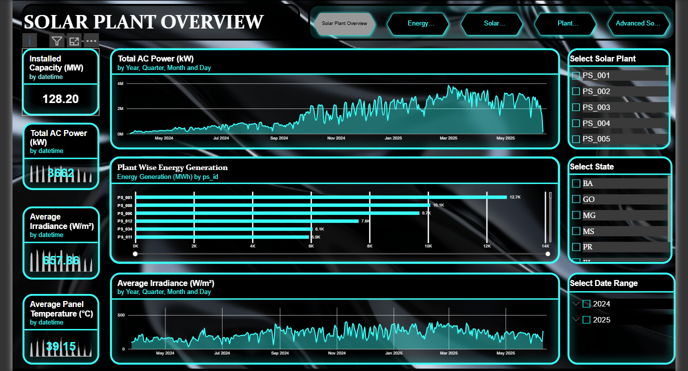
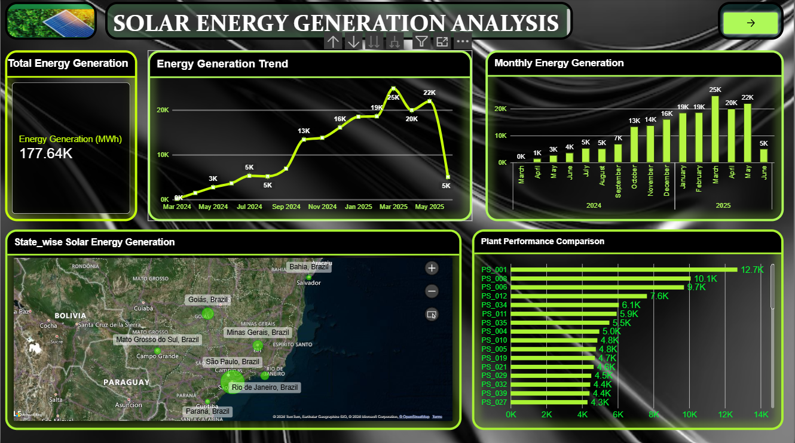
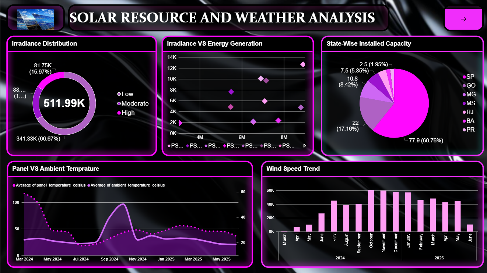
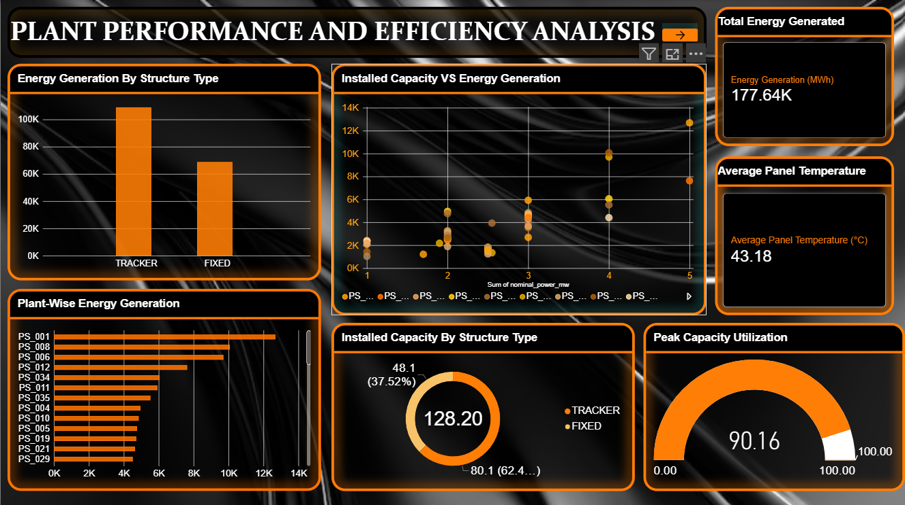
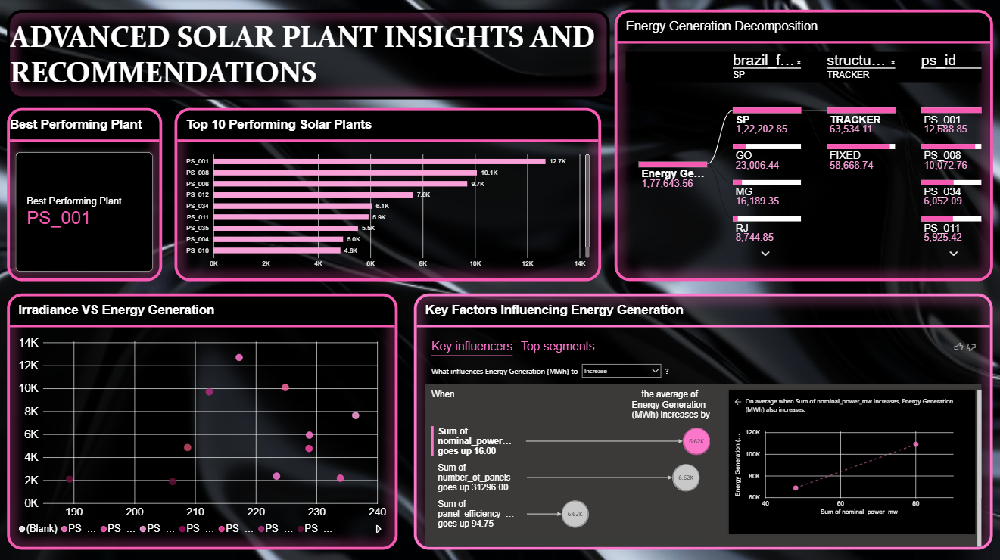

# ☀️ Solar PV Plant Performance & Efficiency Analytics

### 📊 Power BI | Solar Energy | Data Analytics

[](https://powerbi.microsoft.com/)
[](https://www.python.org/)
[](https://pandas.pydata.org/)
[](https://learn.microsoft.com/dax/)

An interactive Power BI analytics platform designed to analyze solar photovoltaic (PV) plant performance, energy generation, weather conditions, and operational efficiency.

The project transforms plant-level solar, inverter, and meteorological data into interactive dashboards to explore energy generation patterns, compare solar plants, analyze environmental conditions, and identify factors associated with energy generation.

---

## 🚀 Project Highlights

- 📈 Solar energy generation and performance analysis
- ☀️ Solar irradiance and weather analysis
- 🌡️ Panel and ambient temperature monitoring
- 🏭 Plant-wise performance comparison
- ⚡ Installed capacity and energy generation analysis
- 🔍 Key factors influencing energy generation
- 📊 Interactive Power BI dashboards
- 🧮 DAX-based analytical measures
- 🐍 Python and Pandas-based data preparation
- 🗂️ Star-schema-based Power BI data model

---

## 📌 Project Status

| Category | Details |
|---|---|
| 📊 Project Type | Data Analytics & Business Intelligence |
| ☀️ Domain | Solar Energy / Photovoltaic Systems |
| 🛠️ Primary Tool | Microsoft Power BI |
| 🧮 Analytics | DAX |
| 🐍 Data Processing | Python & Pandas |
| 📈 Visualization | Interactive Power BI Dashboards |
| 📄 Dashboard Pages | 5 |
| 📂 PV Plants Analyzed | 51 |
| ⏱️ Data Resolution | 15 minutes |

## 🔗 Quick Navigation

- 📊 [Dashboard Preview](#-dashboard-preview)
- 📐 [Key DAX Measures](#-key-dax-measures)
- 📂 [Dataset](#-dataset)
- 🧮 [Advanced Power BI Analytics](#-advanced-power-bi-analytics)
- 📚 [Project Documentation](#-project-documentation)
- 👩‍💻 [Author](#-author)

## 📌 Project Overview

This project focuses on analyzing the performance and efficiency of solar photovoltaic (PV) plants using Microsoft Power BI.

The dashboard combines solar power generation, irradiance, temperature, wind, precipitation, and plant metadata to identify performance variations, compare solar plants, and understand factors associated with energy generation.

The project demonstrates an end-to-end data analytics workflow covering:

**Data Collection → Data Cleaning → Data Modeling → DAX → Visualization → Analysis → Insights**

---

## 🎯 Problem Statement

To analyze and evaluate the performance of solar PV plants using power generation, irradiance, temperature, and environmental data in order to identify performance variations, determine factors affecting energy generation, and provide data-driven insights for solar plant analysis.

---

## 🎯 Project Objectives

- Analyze solar energy generation across photovoltaic plants
- Compare plant-wise and state-wise performance
- Study the relationship between irradiance and energy generation
- Analyze panel and ambient temperature variations
- Compare fixed and tracker-based structures
- Evaluate installed capacity and capacity utilization
- Identify factors associated with energy generation
- Analyze environmental conditions affecting solar performance
- Build interactive dashboards for plant-level analysis
- Provide data-driven insights through Power BI analytics

---

## 🛠️ Tools & Technologies

| Tool / Technology | Purpose |
|---|---|
| **Power BI** | Dashboard development and interactive visualization |
| **DAX** | Analytical measures and KPI calculations |
| **Python** | Data preprocessing and cleaning |
| **Pandas** | Data manipulation and transformation |
| **Microsoft Excel** | Data inspection and supporting analysis |
| **Power BI Data Modeling** | Relationships and analytical model |
| **Data Visualization** | Charts, KPIs, maps, decomposition and influencers |

---

## 📂 Dataset

The project uses the **BR-PVGen photovoltaic generation dataset**.

### Dataset Details

- **Dataset:** BR-PVGen
- **Data period:** March 2024 – June 2025
- **Time resolution:** 15 minutes
- **Number of PV plants:** 51
- **Geographic coverage:** Brazil
- **Generation data:** AC power, DC power and reactive power
- **Meteorological data:** GHI, GRI, POA irradiance, temperature, wind and precipitation
- **Plant metadata:** installed capacity, number of panels, panel efficiency, structure type and bifacial information

### Dataset Source

BR-PVGen photovoltaic generation dataset:

https://zenodo.org/records/21511487

The dataset is provided under the **CC BY 4.0** license.

For detailed dataset documentation, see:

📂 [Dataset Source Documentation](Dataset/Dataset_Source.md)

---

## 🧹 Data Preparation & Cleaning

The raw dataset was processed before importing it into Power BI.

### Data Cleaning

- Combined multiple inverter data files
- Combined meteorological data files
- Standardized datetime fields
- Converted numerical fields into appropriate data types
- Handled missing and invalid records
- Removed invalid negative power values
- Prepared plant metadata for analysis
- Created cleaned datasets for Power BI
- Prepared dimensions required for the analytical model

### Tools Used

**Python + Pandas** were used for data preprocessing, cleaning, transformation, and preparation.

---

## 🗂️ Data Model

A star-schema-based Power BI data model was developed to connect plant, datetime, inverter, and meteorological information.

### Main Tables

- `Dim_Plant`
- `Dim_DateTime`
- `Cleaned_Inverter_Data`
- `Cleaned_Meteorological_Data`

### Model Structure

The dimension tables provide filtering and analytical context for the fact tables.

```text
                    ┌──────────────────┐
                    │    Dim_Plant     │
                    └────────┬─────────┘
                             │
                 ┌───────────┴───────────┐
                 │                       │
                 ▼                       ▼
     ┌──────────────────────┐  ┌────────────────────────┐
     │ Cleaned_Inverter_Data│  │Cleaned_Meteorological  │
     │                      │  │        _Data           │
     └──────────┬───────────┘  └────────────┬───────────┘
                │                           │
                └──────────┬────────────────┘
                           │
                           ▼
                  ┌─────────────────┐
                  │  Dim_DateTime   │
                  └─────────────────┘

```
---

## 📸 Dashboard Preview

The Power BI report contains five interactive dashboard pages covering solar plant overview, energy generation, weather analysis, plant performance, and advanced solar insights.

### 1️⃣ Solar Plant Overview

Provides a high-level view of installed capacity, AC power, irradiance, temperature, and plant-wise energy generation.



---

### 2️⃣ Solar Energy Generation Analysis

Analyzes energy generation trends, monthly generation, state-wise distribution, and plant performance.



---

### 3️⃣ Solar Resource & Weather Analysis

Explores solar irradiance, temperature variations, wind conditions, and their relationship with energy generation.



---

### 4️⃣ Plant Performance & Efficiency Analysis

Compares plant performance using energy generation, installed capacity, structure type, and capacity utilization.



---

### 5️⃣ Advanced Solar Plant Insights

Uses Key Influencers and Decomposition Tree visuals to explore factors associated with energy generation.



---

## 📐 Key DAX Measures

The Power BI dashboard uses DAX measures to calculate important solar plant performance indicators.

```DAX
Total AC Power (kW) =
DIVIDE(
    SUM(Cleaned_Inverter_Data[total_active_power_w]),
    1000
)

Energy Generation (MWh) =
DIVIDE(
    SUM(Cleaned_Inverter_Data[total_active_power_w]),
    1000
) * 0.25 / 1000

Peak AC Power (MW) =
DIVIDE(
    MAXX(
        VALUES(Dim_DateTime[datetime]),
        CALCULATE(
            SUM(Cleaned_Inverter_Data[total_active_power_w])
        )
    ),
    1000000
)

Peak Capacity Utilization (%) =
DIVIDE(
    [Peak AC Power (MW)],
    SUM(Dim_Plant[nominal_power_mw])
) * 100

Best Performing Plant =
VAR PlantTable =
    ADDCOLUMNS(
        VALUES(Dim_Plant[ps_id]),
        "PlantEnergy", [Energy Generation (MWh)]
    )
VAR TopPlant =
    TOPN(
        1,
        PlantTable,
        [PlantEnergy],
        DESC
    )
RETURN
    CONCATENATEX(
        TopPlant,
        Dim_Plant[ps_id],
        ", "
    )
```

---

## 🧮 Advanced Power BI Analytics

The project uses advanced Power BI analytical features to explore solar plant performance and identify factors associated with energy generation.

### 🔍 Key Influencers

The **Key Influencers** visual is used to analyze factors associated with **Energy Generation (MWh)**.

The analysis considers:

- Installed capacity (`nominal_power_mw`)
- Structure type
- Panel efficiency
- Number of panels
- Bifacial configuration

This visual helps explore how different plant characteristics are associated with variations in energy generation.

### 🌳 Decomposition Tree

The **Decomposition Tree** is used to break down total energy generation across multiple dimensions.

The analysis can be explored through:

**Total Energy Generation → State → Structure Type → Solar Plant**

This allows users to interactively drill down from overall generation to individual plant-level performance.

### 📊 Advanced Analytical Features

The Power BI report also uses:

- Interactive slicers and filters
- Drill-down analysis
- KPI cards
- Azure Maps
- Key Influencers
- Decomposition Tree
- Scatter plot analysis
- Dynamic plant-level comparisons

These features transform the dashboard from a basic visualization report into an interactive analytical platform.

---

---

## 📚 Project Documentation

Detailed documentation of the project development process is available in the repository.

The documentation covers:

- 📌 Project overview and problem statement
- 🎯 Project objectives
- 🛠️ Tools and technologies used
- 📂 Dataset details
- 🧹 Data cleaning and preprocessing
- 🗂️ Power BI data model and relationships
- 🧮 DAX measures
- 📊 Dashboard page descriptions
- 🔍 Key analytical insights
- 🚀 Future improvements

📖 **[View Complete Project Documentation](Documentation/Project_Documentation.md)**

---

## 👩‍💻 Author

### Derfini C T

**Electronics & Communication Engineering**

🔗 [LinkedIn](https://www.linkedin.com/in/derfini-c-t/)

### Project Focus

**Power BI | Data Analytics | DAX | Python | Solar Energy Analytics**


